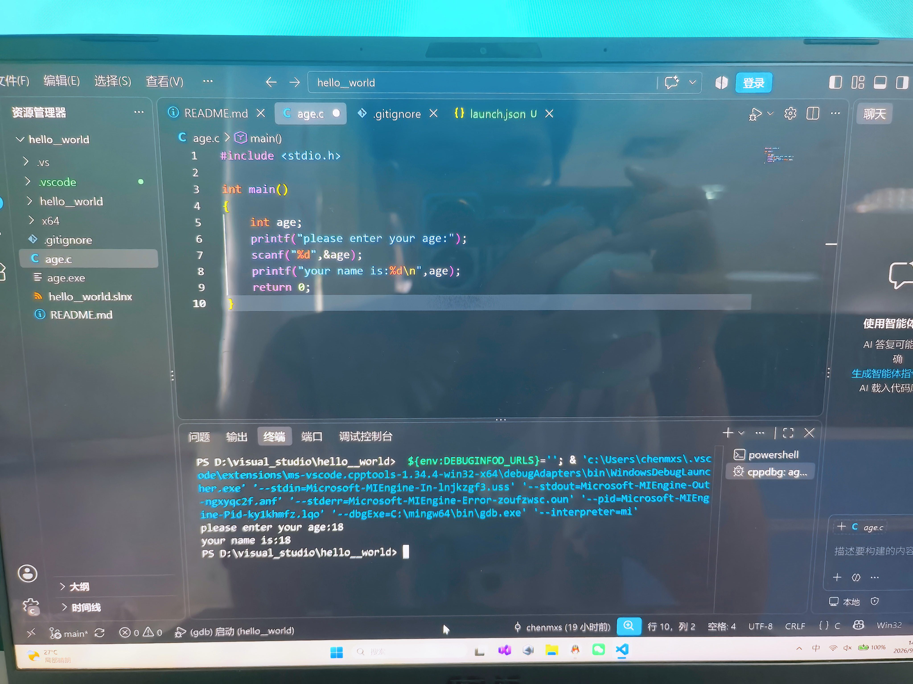
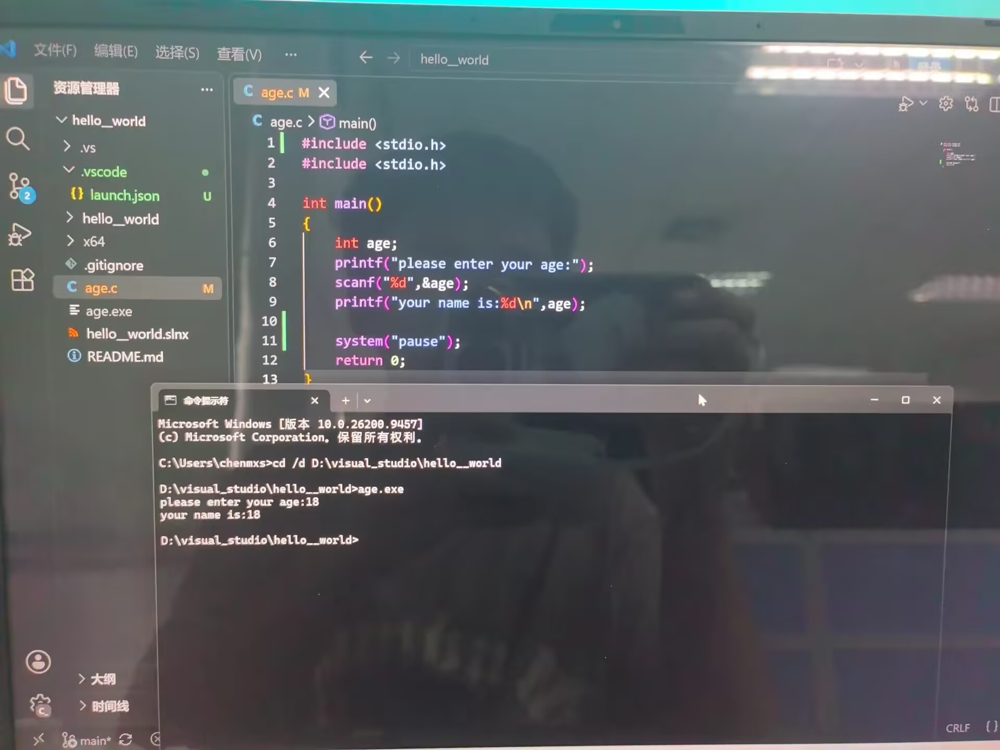

# 微光招新题

# Day1
## 今日完成
·成功尝试通过git上传文件
·独立写了一个helloworld程序

# Day2
## 今日完成（括号内是ai辅助）
·三个json（1）c_cpp_properties.json,作用：（给vscode编辑器用的）程序纠错，不参与程序运行
        （2）tasks.json,作用：(vscode通过gcc)把.c代码转化为.exe格式，使代码可以运行
         （3）launch.json,作用：（给gdb用的）寻找程序，启动调试，控制弹外置黑框/内置终端
·独立完成九九乘法表，调试踩坑：printf（）直接在双引号里写i*j，结果全是i，j，不会换行
·调试截图

        